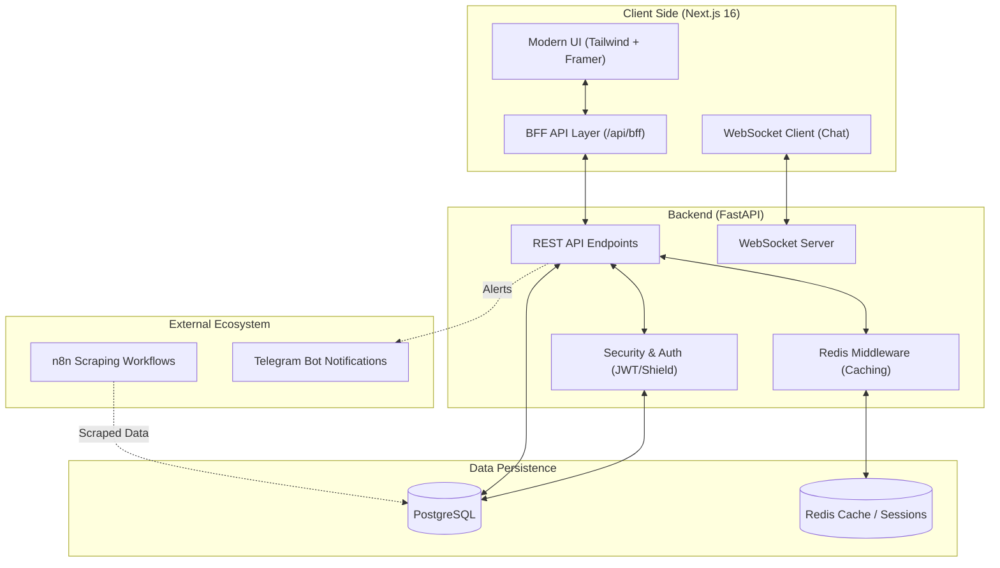

# 🌟 lifesuck: Premium Data Management Platform

[](https://nextjs.org/)
[](https://fastapi.tiangolo.com/)
[](https://tailwindcss.com/)
[](https://opensource.org/licenses/MIT)

**lifesuck** is a high-performance, enterprise-grade platform designed for seamless data management and analytics. Built with a focus on **visual excellence**, **real-time interaction**, and **architectural integrity**, it provides a premium experience for both administrators and end-users.

---

## 🏗️ System Architecture



---

## ✨ Core Features

- **🚀 Premium Dashboard**: State-of-the-art data visualization with interactive charts and real-time status tracking.
- **🛡️ Enterprise Security**: Multi-layered protection using a custom "Shield" middleware and JWT-based authentication.
- **💬 Real-time Stream**: Low-latency public chat with automated moderation and administrative controls.
- **🏢 Administrative Suite**: Comprehensive user management, IP tracking, and access logging for full oversight.
- **🎨 Glassmorphism UI**: A stunning, responsive design with dynamic themes and smooth micro-animations.

---

## 🚀 Quick Start

### 1. Prerequisites
- Node.js 18+ & npm
- Python 3.10+
- PostgreSQL & Redis (active)

### 2. Backend Setup
```bash
cd backend
python -m venv venv
source venv/bin/activate  # atau venv\Scripts\activate trên Windows
pip install -r requirements.txt
python main.py
```

### 2.1 Redis Setup (Recommended)
- The backend cache now supports Redis via `REDIS_URL`.
- In Docker Compose, local Redis is optional (profile `local-redis`) and memory-capped (`maxmemory 256mb`).
- Default internal URL in compose is `redis://redis:6379/0`.

Use Redis Cloud (recommended for low-RAM hosts):
```bash
# PowerShell (temporary for current shell)
$env:REDIS_URL = "rediss://default:<YOUR_REDIS_KEY>@redis-12411.c252.ap-southeast-1-1.ec2.cloud.redislabs.com:12411/0"
docker compose up -d --build backend frontend
```

If your Redis Cloud plan does not use TLS, switch `rediss://` to `redis://`.

Run stack with Redis:
```bash
# External Redis Cloud (no local Redis container)
docker compose up -d backend frontend

# Local Redis (optional)
docker compose --profile local-redis up -d redis backend frontend
```

For non-Docker deployments, set `REDIS_URL` in your runtime environment before starting backend.

### 3. Frontend Setup
```bash
cd frontend
npm install
npm run dev
```

---

## 📚 Documentation
- [Architecture Deep Dive](docs/ARCHITECTURE.md)
- [API Specification](docs/API_SPEC.md)
- [AI Agent Guidelines](AGENTS.md)

## ⚖️ License
Distributed under the MIT License. See `LICENSE` for more information.

---
<p align="center">Made with ❤️ for the <b>lifesuck</b> community.</p>
