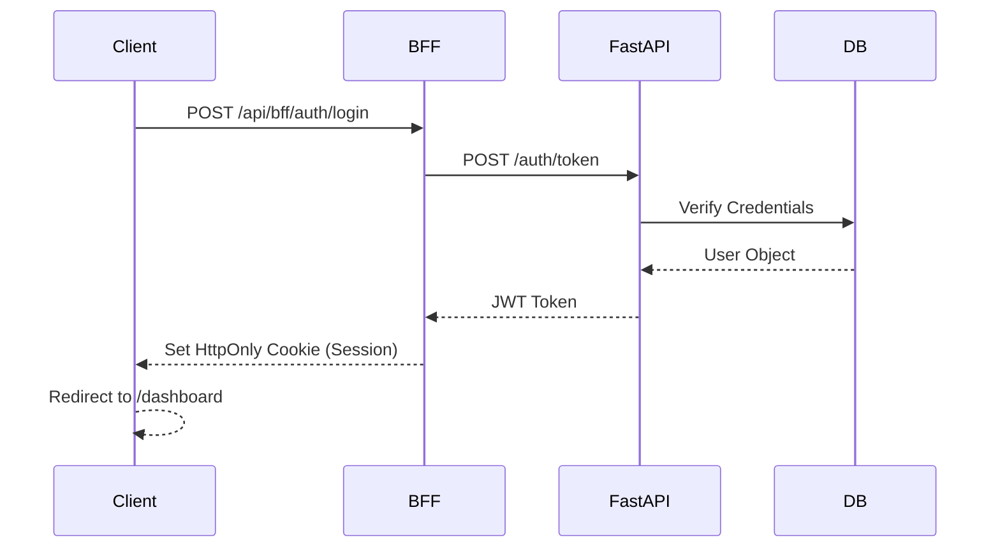

# 🏛️ Technical Architecture: lifesuck

This document provides a detailed breakdown of the architectural decisions and patterns used in the **lifesuck** ecosystem.

## 🎯 Design Philosophy
The system is built on three pillars: **Performance**, **Security**, and **Developer Experience (DX)**. We utilize a modern stack to ensure rapid iteration cycles without compromising system stability.

---

## 🏗️ Architectural Patterns

### 1. Backend-for-Frontend (BFF)
Instead of the frontend communicating directly with the core microservices (if any) or the database, all requests pass through a **BFF layer** located at `frontend/app/api/bff`.
- **Aggregation**: Combines multiple backend calls into a single response.
- **Security**: Handles session verification and sensitive header stripping.
- **Transformation**: Shields the UI from breaking backend schema changes.

### 2. Shield Middleware (Security Layer)
A custom middleware (`backend/shield.py`) acts as the project's guardian.
- **IP Defense**: Blocks maliciously acting IP addresses.
- **Fingerprinting**: Tracks devices to prevent multi-account abuse.
- **Rate Limiting**: Protects expensive endpoints (like Search or Scraping) from DDoS.

### 3. Reactive Data Flow
The Dashboard uses **Next.js Server Components (RSC)** for initial data fetching and **Client Components** with `useEffect` or WebSockets for real-time updates.
- **Caching**: Redis is used for high-frequency data (Online User count, Chat stats).
- **Consistency**: PostgreSQL ensures ACID compliance for student records and user credentials.

---

## 🔄 Sequence Diagrams

### Authentication Flow

---

## 💾 Data Persistence Schema
- **`nick`**: Core user accounts and roles.
- **`sinh_vien`**: Primary records for the platform's subjects.
- **`bang_diem`**: Detailed metrics and results associated with subjects.
- **`chat_messages`**: High-performance log for real-time interaction.
- **`user_ip_log`**: Security auditing trail.

---

## 🚀 Execution Environment
- **Dev**: Managed via `npm run dev` and `uvicorn`.
- **Prod**: Dockerized with multi-stage builds for minimal image size.
- **Testing**: Pre-deployment gate with `Pytest` and `Playwright`.
